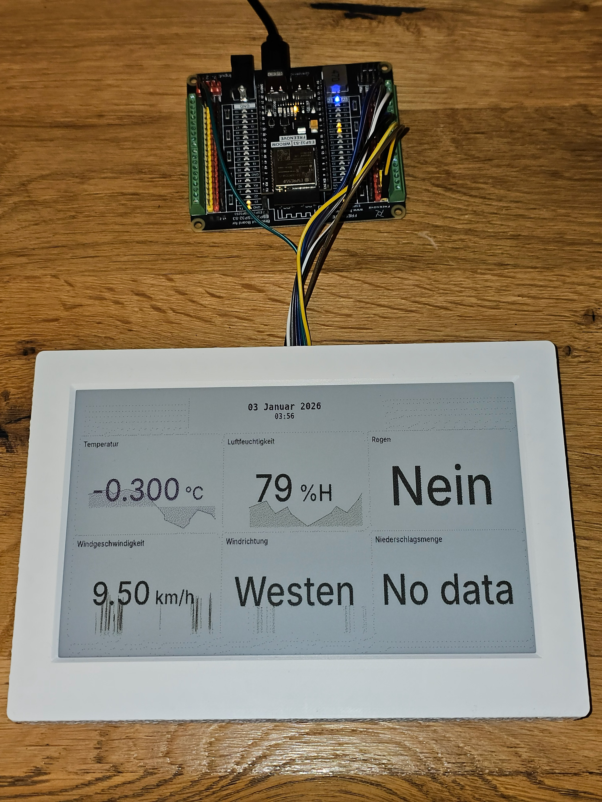
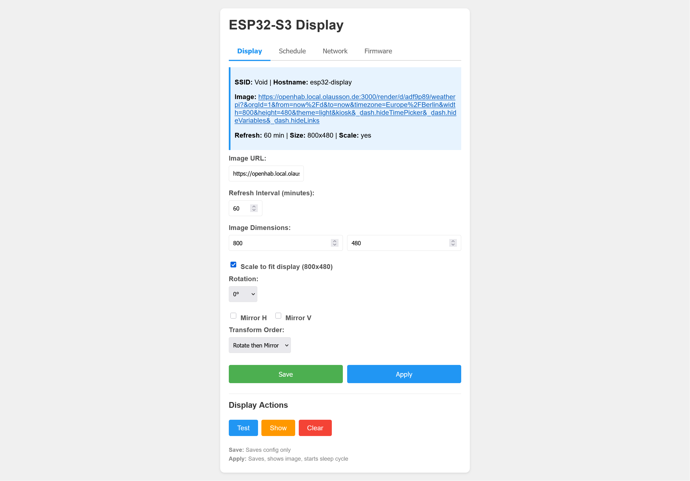

# ESP32-S3 E-Paper Display Controller

WiFi-enabled firmware for driving a 7-color e-paper display from an ESP32-S3. Downloads PNG images from any URL and renders them with Floyd-Steinberg dithering for optimal color reproduction. Perfect for dashboards, weather displays, or digital signage.
  
⚠️⚠️ This was entirely coded using an LLM! ⚠️⚠️






## Features

- 📥 **Image Download** - Fetches PNG images from any HTTP/HTTPS URL
- 🎨 **7-Color Dithering** - Floyd-Steinberg dithering for Black, White, Red, Yellow, Orange, Blue, Green
- 🔄 **Auto Scaling** - Bilinear interpolation to scale images to display size
- 🔃 **Image Transforms** - Rotate (90°, 180°, 270°) and mirror (horizontal/vertical) images
- 🌐 **Web Configuration** - Browser-based setup portal for WiFi and image settings
- 😴 **Deep Sleep** - Configurable refresh interval with ultra-low power sleep
- 📅 **Schedule Plans** - Time-based refresh schedules with day-of-week support
- 🕐 **NTP Time Sync** - Automatic time synchronization with configurable timezone
- 📡 **OTA Updates** - Update firmware over-the-air via the web interface
- ⚠️ **Error Display** - User-friendly error messages on screen when image loading fails
- 💡 **LED Status** - RGB LED feedback for connection and operation status
- 🔘 **Setup Mode** - Hold boot button during startup to enter configuration mode
- 🌍 **Captive Portal** - Auto-redirect to configuration page when in AP mode

## Hardware

| Component | Model |
|-----------|-------|
| Microcontroller | ESP32-S3-WROOM with 8MB PSRAM |
| Display | Waveshare 7.3 inch E Ink Spectra 6 (E6) Full Color E-Paper Display |
| HAT | Waveshare 7.3 inch e-Paper HAT (E) (epd7in3e) |
| LED | WS2812 RGB (onboard or external) |

### Pin Connections

| E-Paper Pin | ESP32-S3 GPIO | Notes |
|-------------|---------------|-------|
| VCC | 3.3V | Power supply |
| GND | GND | Ground |
| DIN (MOSI) | GPIO 11 | SPI2 default MOSI |
| CLK (SCK) | GPIO 12 | SPI2 default SCK |
| CS | GPIO 10 | SPI2 default CS |
| DC | GPIO 9 | Data/Command control |
| RST | GPIO 8 | Reset |
| BUSY | GPIO 7 | Busy status input |

| Other | GPIO | Notes |
|-------|------|-------|
| WS2812 LED | GPIO 48 | Onboard RGB LED |
| Boot Button | GPIO 0 | Setup mode trigger |

> **Pin Selection Rationale:** GPIO 11, 12, 10 are the default SPI2 (HSPI) pins on ESP32-S3. GPIO 7, 8, 9 are general-purpose GPIOs that are safe to use (not strapping pins). This avoids GPIO 0 (boot button), GPIO 48 (LED), and USB pins (19, 20).

### Power Consumption

| State | Power |
|-------|-------|
| Active (downloading & displaying) | < 1 W (< 200 mA at 5 V) |
| Deep Sleep | ~0.05 W |

**Example:** Refreshing the display every minute for 10 minutes consumes approximately 0.04 Wh (8 mAh at 5 V). For 1 hour of operation (displaying an image every 1 minute), the total energy consumption is around 0.2 Wh (0.04 Ah at 5 V) — ideal for battery-powered or solar applications.

## Software Requirements

- [PlatformIO](https://platformio.org/) (VS Code extension or CLI)
- ESP-IDF framework (automatically installed by PlatformIO)

## Installation

### Building from Source

1. Clone the repository:
   ```bash
   git clone https://github.com/bolausson/esp32-ePaper-Display.git
   cd esp32-ePaper-Display
   ```

2. Create your WiFi configuration (optional):
   ```bash
   cp include/wifi_config.h.example include/wifi_config.h
   ```
   Edit `include/wifi_config.h` with your WiFi credentials (can also configure via web interface).

3. Build and upload:
   ```bash
   pio run --target upload
   ```

4. Monitor serial output (optional):
   ```bash
   pio device monitor
   ```
   ⚠️ The device monitor may wake the device from deep sleep and start the web server, which is the same behaviour as when the 'boot' button is pressed manually.

### Flashing Pre-built Firmware

If you downloaded a pre-built release, you can flash it using [esptool.py](https://github.com/espressif/esptool):

#### First-Time Flash (Complete)

For a fresh ESP32-S3, flash all three files:

```bash
esptool.py --chip esp32s3 -p COM9 -b 921600 --before default_reset --after hard_reset write_flash \
  0x0 bootloader.bin \
  0x8000 partitions.bin \
  0x20000 firmware.bin
```

Replace `COM9` with your serial port (`/dev/ttyUSB0` on Linux, `/dev/cu.usbserial-*` on macOS).

#### Firmware-Only Flash

If you've previously flashed the bootloader and partition table:

```bash
esptool.py --chip esp32s3 -p COM9 -b 921600 write_flash 0x20000 firmware.bin
```

### OTA (Over-The-Air) Update

Once the device is running, you can update the firmware wirelessly:

1. Enter setup mode by holding the **Boot button** during wake-up or reset
2. Connect to the device's web interface (`http://<device-ip>/`)
3. Navigate to the **Firmware Update** tab
4. Click **Choose File** and select the new `firmware.bin`
5. Click **Upload & Install**
6. Wait for the upload to complete and the device to reboot

The device validates the new firmware on first boot. If it fails to start properly, it will automatically roll back to the previous version.

## Usage

### First-Time Setup

1. Power on the device while holding the **Boot button**
2. The LED will blink yellow indicating web server mode
3. Connect to WiFi - the device connects to your configured network
4. Open `http://<device-ip>/` in a browser
5. Configure:
   - WiFi credentials
   - Image URL (PNG, ideally 800×480)
   - Refresh interval (minutes)
   - Image scaling options
   - Image rotation (0°, 90°, 180°, 270°)
   - Mirror options (horizontal/vertical)
6. Click **Save Configuration** to save settings, or **Apply** to save and immediately display the image

### Normal Operation

1. Device wakes from deep sleep
2. Connects to WiFi
3. Downloads and processes the image
4. Updates the e-paper display
5. Returns to deep sleep for the configured interval

### Re-entering Setup Mode

Hold the **Boot button** while pressing **Reset**, or during wake-up from deep sleep.

## LED Status Indicators

| Color | Pattern | Meaning |
|-------|---------|---------|
| Yellow | Blinking | Web server running |
| Red | Blinking | WiFi not connected |
| Green | Solid | WiFi connected |
| Blue | Solid | Downloading image |
| Cyan | Solid | Updating display |
| Blue | 3 blinks | Entering deep sleep |

> **Tip:** The status LED can be disabled entirely via the "Disable Status LED" checkbox in the Display tab. When disabled, the LED remains off during all operations.

## Image Requirements

- **Format:** PNG
- **Recommended size:** 800×480 pixels
- **Scaling:** Enable "Scale to fit" for other sizes
- **Colors:** Best results with the 7-color palette

### Example: Grafana Dashboard

This project works great with Grafana's image rendering:
```
https://your-grafana-server/render/d/dashboard-id/dashboard-name?width=800&height=480&theme=light
```

## Project Structure

```
├── src/
│   ├── main.c              # Main application
│   ├── epd_7in3e.c         # E-paper display driver
│   └── image_processor.c   # PNG decode, scale, dither
├── include/
│   ├── epd_7in3e.h
│   └── image_processor.h
├── lib/
│   └── pngle/              # PNG decoder library
├── platformio.ini          # PlatformIO configuration
└── partitions_singleapp_large.csv
```

## Configuration Options

| Setting | Description | Default |
|---------|-------------|---------|
| WiFi SSID | Your WiFi network name | - |
| WiFi Password | Your WiFi password | - |
| Image URL | URL to PNG image (max 2048 characters) | - |
| Refresh Interval | Minutes between updates | 60 |
| Image Width | Expected source image width | 800 |
| Image Height | Expected source image height | 480 |
| Scale to Fit | Scale image to 800×480 | No |
| Rotation | Rotate image (0°, 90°, 180°, 270°) | 0° |
| Mirror Horizontal | Flip image horizontally | No |
| Mirror Vertical | Flip image vertically | No |
| Transform Order | Apply rotation before or after mirroring | Rotate first |
| Disable Status LED | Turn off the RGB status LED entirely | No |
| NTP Server | Time server for synchronization | pool.ntp.org |
| Timezone | TZ database timezone name | Europe/Berlin |
| Daylight Saving | Enable automatic DST adjustment | Yes |
| Schedule Enabled | Use schedule-based refresh intervals | No |
| Schedule Plans | JSON configuration for time-based schedules | Default plan |

### Supported Timezones

The following timezone names are supported (automatically converted to POSIX format):

| Region | Timezones |
|--------|-----------|
| Europe | Berlin, London, Paris, Amsterdam, Rome, Madrid, Vienna, Brussels, Stockholm, Oslo, Copenhagen, Helsinki, Athens, Moscow, Zurich |
| Americas | New_York, Chicago, Denver, Los_Angeles, Phoenix, Toronto, Vancouver, Sao_Paulo, Mexico_City |
| Asia | Tokyo, Shanghai, Hong_Kong, Singapore, Seoul, Kolkata, Dubai, Bangkok, Jakarta |
| Australia/Pacific | Sydney, Melbourne, Brisbane, Perth, Auckland, Honolulu |
| Other | UTC, GMT |

Use the format `Continent/City` (e.g., `Europe/Berlin`, `America/New_York`). You can also enter a POSIX TZ string directly for unsupported timezones.

## Schedule Plans

The Schedule Plans feature allows you to define different refresh intervals based on the time of day and day of week. This is useful for scenarios like:
- More frequent updates during daytime, less at night
- Different schedules for weekdays vs weekends
- Reduced refresh during sleeping hours to save power

### How It Works

1. **Plans** - Create up to 4 named schedule plans (e.g., "Workdays", "Weekend", "Holiday")
2. **Periods** - Each plan contains time periods with different refresh intervals (up to 8 per plan)
3. **Day Assignment** - Assign a plan to each day of the week

### Configuration

Access the **Schedule** tab in the web configuration interface:

1. **Enable Schedule** - Check "Enable schedule-based refresh intervals" to activate
2. **Day Grid** - Shows Mon-Sun with dropdowns to assign a plan to each day (today is highlighted)
3. **Plan Tabs** - Click to switch between plans, use "+ New" to create additional plans
4. **Period Table** - Configure start time, end time, and refresh interval (in minutes) for each period
5. **Presets** - Quick setup buttons:
   - **Simple**: Single all-day period (00:00-00:00) with 60-minute interval
   - **Day/Night**: Two periods - daytime (06:00-22:00, 30 min) and nighttime (22:00-06:00, 120 min)

### Example Schedule

| Day | Plan | Time Period | Interval |
|-----|------|-------------|----------|
| Mon-Fri | Workdays | 06:00-22:00 | 30 min |
| Mon-Fri | Workdays | 22:00-06:00 | 120 min |
| Sat-Sun | Weekend | 00:00-00:00 | 60 min |

### Refresh Interval Priority

The device determines which refresh interval to use in the following order:

1. **Schedule interval** - If scheduling is enabled AND the current time matches a defined period, that period's interval is used
2. **Default interval** - The "Refresh Interval" setting from the Display tab is used as a fallback when:
   - Scheduling is disabled, OR
   - No schedule period matches the current time

**Note:** Saving settings on the Display tab does NOT affect your schedule configuration. The two are independent — the Display tab interval only serves as a fallback.

### Notes

- Time periods use 24-hour format (HH:MM)
- A period with start and end time of "00:00" covers the entire day
- Periods can span midnight (e.g., 22:00-06:00)
- If no matching period is found for the current time, the default refresh interval is used
- Schedule evaluation uses the device's local time (synced via NTP)

## Troubleshooting

### WiFi connection fails
- Verify WiFi network is 2.4GHz (ESP32 doesn't support 5GHz)
- Check serial monitor for error messages
- Re-enter setup mode to update credentials

### Image not displaying correctly
- Ensure image URL is accessible from the device's network
- Check that the URL returns a valid PNG image
- For HTTPS URLs, the server must have a valid certificate

### Device doesn't wake from sleep
- Press the Boot button while the device is sleeping
- The boot button also triggers wake-up from deep sleep

### Time shows incorrect timezone
- Enter the timezone in `Continent/City` format (e.g., `Europe/Berlin`)
- Check the [supported timezones](#supported-timezones) list
- For unsupported timezones, use POSIX TZ format (e.g., `CET-1CEST,M3.5.0,M10.5.0/3`)
- Click "Sync Now" to force a time update

### OTA update fails
- Ensure the firmware file is a valid `.bin` file
- Check that you have enough free space (the device uses A/B partitions)
- If the device becomes unresponsive after an update, it will auto-rollback after reboot
- For recovery, flash via USB using esptool

## License

[![CC BY-NC-SA 4.0][cc-by-nc-sa-shield]][cc-by-nc-sa]

This work is licensed under a
[Creative Commons Attribution-NonCommercial-ShareAlike 4.0 International License][cc-by-nc-sa].

[![CC BY-NC-SA 4.0][cc-by-nc-sa-image]][cc-by-nc-sa]

[cc-by-nc-sa]: http://creativecommons.org/licenses/by-nc-sa/4.0/
[cc-by-nc-sa-image]: https://licensebuttons.net/l/by-nc-sa/4.0/88x31.png
[cc-by-nc-sa-shield]: https://img.shields.io/badge/License-CC%20BY--NC--SA%204.0-lightgrey.svg

## Acknowledgments

- [Waveshare](https://www.waveshare.com/) for the e-paper display
- [pngle](https://github.com/kikuchan/pngle) - Lightweight PNG decoder
- [ESP-IDF](https://github.com/espressif/esp-idf) - Espressif IoT Development Framework

